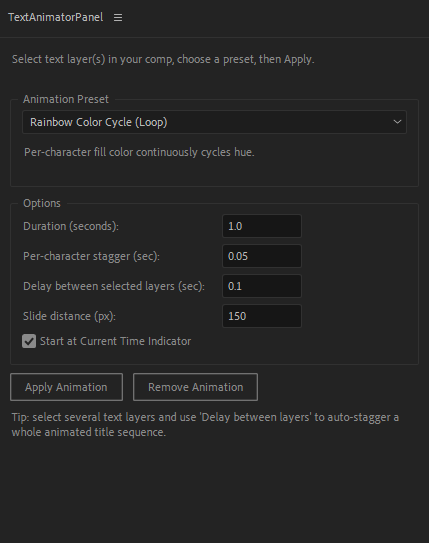

# Text Animator Panel

A free After Effects extension for creating dynamic text animations with ease.

## Features

- Intuitive text animation controls
- Real-time preview
- Multiple animation presets
- Customizable timing and effects
- User-friendly panel interface

## Installation

1. Download the Text Animator Panel files
2. Copy the `.jsxbin` file to your After Effects Scripts folder:
   - **Windows**: `C:\Program Files\Adobe\Adobe After Effects [version]\Support Files\Scripts\ScriptUI Panels\`
3. Restart After Effects
4. Open the panel from **Window > Text Animator Panel**

## Usage

1. **Open the Panel**: Go to **Window > Text Animator Panel**
2. **Select Text Layer**: Choose a text layer in your composition
3. **Choose Animation**: Select an animation preset from the panel
4. **Adjust Settings**: Customize timing, speed, and effects to your preference
5. **Apply**: Click "Apply Animation" to add the effect to your selected text layer
6. **Preview**: Press spacebar to preview your animation in real-time

## Tips

- Work with one text layer at a time for best results
- Use keyframes for more control over animation timing
- Experiment with different presets to find your style

## License

Free to use and distribute.

## Support

For issues or questions, please refer to the documentation or contact the developer.